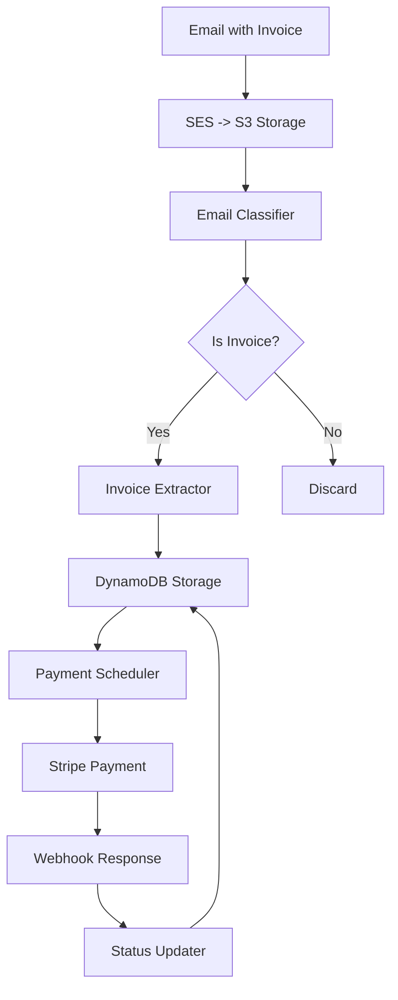

# BillBot

**AI-Powered Invoice Processing & Payment Automation**

BillBot demonstrates the transformative power of AI agents in enterprise workflows by fully automating invoice processing—from email receipt to payment execution. Built with modern serverless architecture and powered by Google Gemini AI, it showcases how intelligent automation can revolutionize accounts payable operations.

## What It Does

BillBot automatically:
- **Receives** invoices via email (any format, with PDFs)
- **Classifies** emails using AI to identify invoices
- **Extracts** structured data (vendor, amount, due date, etc.)
- **Schedules** payments with intelligent urgency handling
- **Processes** payments through Stripe
- **Updates** status via secure webhooks

**Zero human intervention required** from email to payment completion. BillBot processes invoices 40x faster than manual workflows (seconds vs. hours) and eliminates the $25-50 per-invoice processing cost that scales with business growth.

## Architecture



## AI Agent Capabilities

### **Intelligent Document Understanding**
- **Multi-modal AI**: Processes email text + PDF attachments simultaneously
- **Context-aware classification**: Distinguishes invoices from receipts, marketing, etc.
- **Structured extraction**: Converts unstructured documents to actionable data

### **Smart Payment Logic**
- **Urgency detection**: Prioritizes payments due today
- **Batch optimization**: Efficiently processes upcoming payments
- **Error handling**: Automatically retries and logs failures

## Technology Stack

- **Cloud**: AWS Lambda, DynamoDB, S3, SES, API Gateway
- **AI**: Google Gemini 2.5 Flash
- **Payments**: Stripe
- **Runtime**: Python 3.10+
- **Deployment**: Docker containers

## Getting Started

### Prerequisites
- AWS CLI configured (`aws configure`)
- Docker installed
- Stripe account
- Google Cloud account (for Gemini AI)

### Quick Deploy
```bash
# 1. Create DynamoDB table
aws dynamodb create-table --cli-input-json file://infra/dynamodb/table-schema.json

# 2. Build and deploy Lambda functions
cd lambda_functions/email_classifier
docker build -t billbot-email-classifier .
# ... (see infra/README.md for complete deployment guide)

# 3. Test locally
python3 tests/example_classifier_usage.py
python3 tests/example_invoice_extraction.py
```

### Environment Variables
```bash
# Required for AI processing
GEMINI_API_KEY=your_gemini_api_key

# Required for payments
STRIPE_SECRET_KEY=sk_...
STRIPE_WEBHOOK_SECRET=whsec_...

# AWS resources
DYNAMODB_TABLE_NAME=Invoices
```

## Enterprise Value

**ROI Impact**: Save $50,000+ annually on a 2,000 invoice/year volume while achieving 99.5% accuracy rates. **Operational Efficiency**: Process 1,000+ invoices/hour vs. 8-12 invoices/hour manually, enabling finance teams to focus on strategic work instead of data entry. **Scale Economics**: Handle 10x invoice volume growth without proportional staffing increases.

## Demo Use Cases

- **Startup**: Automate vendor payments without hiring AP staff
- **SMB**: Reduce invoice processing from hours to minutes
- **Enterprise**: Scale AP operations without linear cost growth

## Advanced Features

- **Intelligent urgency handling** (today vs. batch processing)
- **Secure webhook verification** for payment confirmations
- **Multi-format document support** (email + PDF analysis)
- **Production/demo modes** for safe testing
- **Comprehensive error handling** and retry logic

## Project Structure

```
billbot/
├── src/                      # Core business logic
├── lambda_functions/         # AWS Lambda handlers
├── infra/                   # Infrastructure as Code
├── tests/                   # Examples & testing
└── sample_emails/           # Test data
```

## Testing

Run the included examples to see BillBot in action:
```bash
python3 tests/example_classifier_usage.py    # Test AI classification
python3 tests/example_invoice_extraction.py  # Test data extraction
python3 tests/test_payment_scheduler_with_stripe.py  # Test payments
python3 tests/test_webhook_e2e.py           # End-to-end testing
```

## Contributing

This project demonstrates AI agent capabilities for enterprise automation. Contributions welcome!

## License

MIT License - feel free to use in your own projects.

---

**Built by [Chinar Dankhara](https://www.linkedin.com/in/chinardankhara)** • Showcasing the future of AI-powered enterprise automation 